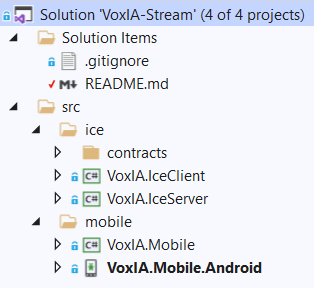

# VoxIA Stream

## Description

An open-source, voice-activated music player for your mobile devices.

## Architecture

### Project Structure

### Technologies

* .NET 5.0
* Xamarin.Forms
	* Xamarin.Forms MessagingCenter
* Xamarin.Android
	* MediaMetadataRetriever
* LibVLCSharp
	* 
* ZeroC Ice

## Mobile Application

### Screen Hierarchy

* Song Library
	* Song Details
		* [Play Now]
* Currently Playing
	* [Play]
	* [Pause]
	* [Stop]
	* [Previous]
	* [Next]
* About

1. Run 'icegridadmin' to setup IceGrid application and start server.
	* Any username or password can be used to login.
	* 'application add <absolute path to Application.xml>'
	* 'server start SimpleServer'
	* 'exit'